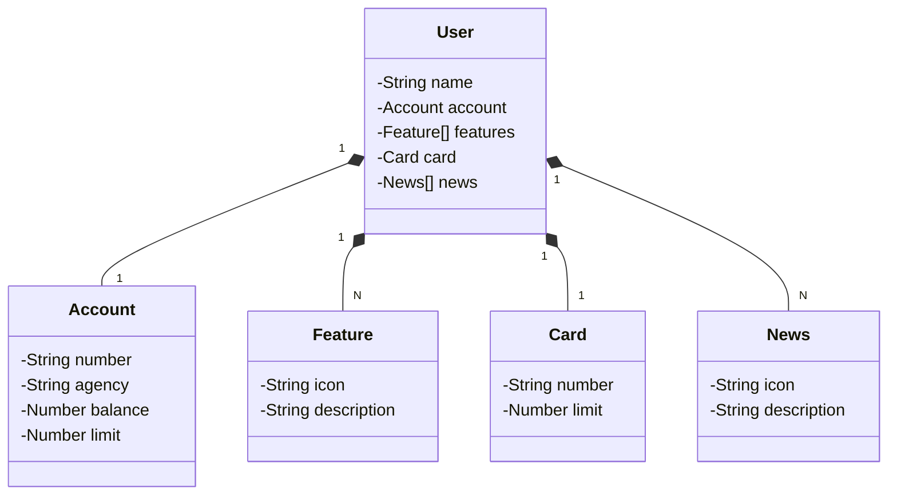

## Santander BootCamp 2024

Java RESTful api criada para o gerenciamento de usuários (Santander Back-End BootCamp).

## Principais Tecnologias
 - **Java 17**: Versão LTS mais recente do Java
 - **Spring Boot 3.2.5**: Para maximizar a produtividade por meio de sua premissa de autoconfiguração.
 - **Spring Data JPA**: Para simplificar nossa camada de acesso aos dados, facilitando a integração com bancos de dados SQL.
 - **Gradle**: Para o gerenciamento de dependências e automação de build.
 - **OpenAPI (Swagger)**: Para criar uma documentação de API eficaz e fácil de entender.
 - **Railway**: Facilita o deploy e monitoramento de nossas soluções na nuvem, além de oferecer diversos bancos de dados como serviço e pipelines de CI/CD.
 - **PostgreSQL / H2 Database**: Para persistir os dados tanto em um banco de produção (PostgreSQL) tanto quanto em um banco de testes (H2).

## Figma

O Figma foi utilizado para a abstração do domínio desta API, sendo útil na análise e projeto da solução. > [Link do Figma](https://www.figma.com/file/0ZsjwjsYlYd3timxqMWlbj/SANTANDER---Projeto-Web%2FMobile?type=design&node-id=1421%3A432&mode=design&t=6dPQuerScEQH0zAn-1) <

## Diagrama de Classes

